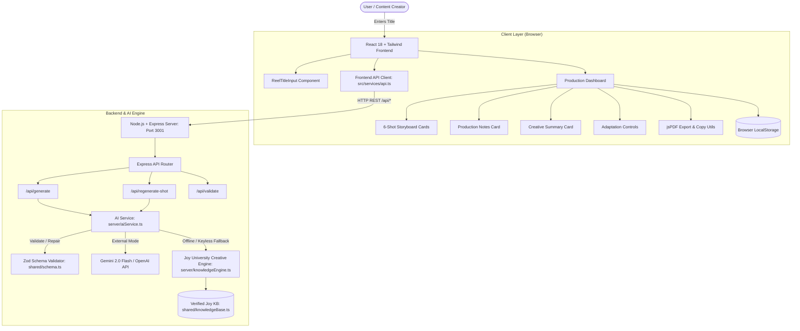

# Technology Stack Audit

## Executive Summary

The **Joy University Reel Storyboard Generator** is a full-stack TypeScript application designed to transform a single Reel topic/title into a complete, 6-shot production-ready video storyboard tailored for Joy University's media production team targeting +2 students.

The application is built on a modern decoupled architecture featuring a **React 18** frontend styled with **Tailwind CSS** (utilizing the Montserrat typography system and Joy University brand palette), powered by a **Vite 6** build toolchain, and supported by a lightweight **Express 4** backend with a hybrid AI engine (Google Gemini / OpenAI API integration paired with an offline Rule-Based Knowledge Engine). Client persistence is handled via browser **LocalStorage**, and document export is implemented programmatically using **jsPDF**.

---

## Complete Stack

| Layer | Technology | Version | Purpose | Verified Usage | Confidence |
| :--- | :--- | :--- | :--- | :--- | :--- |
| **Frontend Framework** | React | 18.3.1 | Core UI view layer & component lifecycle | `src/main.tsx`, `src/App.tsx`, `src/components/*.tsx` | High |
| **Frontend DOM** | React DOM | 18.3.1 | DOM mounting & root rendering | `src/main.tsx` (`createRoot`) | High |
| **Frontend Language** | TypeScript | 5.9.3 | Type-safety, interfaces, shared contracts | All `.ts` and `.tsx` source files | High |
| **Frontend Build Tool** | Vite | 6.4.3 | Dev server, HMR, production bundler | `vite.config.ts`, `package.json` | High |
| **Frontend Vite Plugin** | @vitejs/plugin-react | 4.7.0 | Fast refresh & JSX transformation | `vite.config.ts` | High |
| **Styling Framework** | Tailwind CSS | 3.4.19 | Utility-first CSS & responsive layout | `tailwind.config.js`, `src/index.css`, all components | High |
| **CSS Post-Processor** | PostCSS / Autoprefixer | 8.5.28 / 10.5.5 | CSS vendor prefixing & build pipeline | `postcss.config.js` | High |
| **Iconography** | Lucide React | 1.41.0 | Visual icons across UI controls and badges | All components in `src/components/` | High |
| **Schema Validation** | Zod | 3.25.76 | Runtime schema parsing & repair | `shared/schema.ts`, `server/testSuite.ts` | High |
| **PDF Generation** | jsPDF | 2.5.2 | Vector PDF export for production call sheets | `src/services/exportPdf.ts` | High |
| **HTML Canvas Capture** | html2canvas | 1.4.1 | Installed for canvas rasterization | *Unused* (PDF generated via direct jsPDF) | Low |
| **Backend Runtime** | Node.js | 24.18.0 | Server-side JavaScript runtime | Node process | High |
| **Backend Server** | Express | 4.22.2 | REST API & static file hosting | `server/index.ts` | High |
| **Backend Middleware** | CORS | 2.8.6 | Cross-origin resource sharing headers | `server/index.ts` | High |
| **Environment Config** | dotenv | 16.6.1 | Loading environment variables (`.env`) | `server/index.ts` | High |
| **TypeScript Execution**| tsx | 4.23.13 | Direct TypeScript execution for server/tests | `package.json` scripts, `server/index.ts` | High |
| **Process Orchestration**| concurrently | 9.2.4 | Concurrent dev execution of server & client | `package.json` (`npm run dev`) | High |
| **Client Storage** | Web Storage API (localStorage) | Native | Autosave, saved projects library, API settings | `src/services/storage.ts` | High |
| **External AI Engine** | Google Gemini API / OpenAI API | REST v1beta / v1 | LLM generation for storyboard concepts | `server/aiService.ts` | High |
| **Internal AI Engine** | Knowledge Base Engine | Custom | Deterministic rule-based creative engine | `server/knowledgeEngine.ts` | High |

---

## Frontend Architecture

* **Framework & Paradigm**: React 18 functional components with standard React Hooks (`useState`, `useEffect`).
* **Component Hierarchy**:
  - `src/main.tsx` → `src/App.tsx`
    - `Navbar`: Header bar with brand identity, library counter, and settings modal triggers.
    - `ReelTitleInput`: Single-input creative seed entry with inspiration pills from the 20-title test set.
    - `GenerationLoader`: Progressive step indicator during generation.
    - `StoryboardHeader`: Storyboard metadata, creative angle inline editor, export actions, and regeneration triggers.
    - `GlobalControls`: Adaptation selectors for tone, language (English, Tamil, Tanglish), and duration.
    - `ShotCard` (×6): The 6 sequential shot cards (`HOOK`, `PROBLEM`, `PATTERN_INTERRUPT`, `VALUE`, `PAYOFF`, `CTA`) with inline editable fields, single-shot regeneration, and copy functionality.
    - `ProductionNotesCard`: Production crew notes (visual style, camera, audio, props, locations, casting, complexity).
    - `CreativeSummaryCard`: Core creative idea, top shooting priorities, and fact-safety badge.
    - `ReelLibraryModal`: Project search, status filtering, and version restoration.
    - `SettingsModal`: Custom AI API key and provider configuration.
* **Routing**: Single-page application (SPA) state-driven view switching between "Create" mode and "Production Dashboard" mode.
* **Styling System**: Tailwind CSS with custom brand extension:
  - Primary Crimson: `#AF1E2A`
  - Secondary Neutral: `#524F4F`
  - Typography: Google Fonts **Montserrat** (`index.html`, `tailwind.config.js`).

---

## Backend Architecture

* **Runtime & Framework**: Node.js v24 + Express 4 running TypeScript via `tsx`.
* **API Endpoints**:
  - `GET /api/health`: Service health status check.
  - `POST /api/generate`: Receives `{ reelTitle, creativeDirection, language, duration, apiKey, apiProvider }` and returns a validated 6-shot `ReelStoryboard`.
  - `POST /api/regenerate-shot`: Receives `{ currentStoryboard, shotNumber, shotType, reelTitle, creativeAngle }` and returns an updated `Shot` preserving narrative continuity.
  - `POST /api/validate`: Validates any raw storyboard payload against the strict Zod schema.
* **Static File Serving**: In production mode, Express serves pre-built static assets from `dist/` with fallback to `index.html`.
* **Resilience & Fallback**: If external API credentials are not provided or if external API requests fail/timeout, the backend seamlessly routes generation through the built-in Joy University Knowledge Base Engine (`server/knowledgeEngine.ts`).

---

## Desktop Architecture

* **Status**: **Not a desktop containerized application.**
* There is no Electron, Tauri, Proton, or NW.js configuration in this repository.
* The application runs as a responsive web application compatible with modern desktop, laptop, tablet, and mobile browsers.

---

## Database & Storage

* **Primary Database**: No external SQL or NoSQL database is configured or required for MVP.
* **Local Persistence**: Browser `localStorage` via `src/services/storage.ts`:
  - `joy_reel_current_storyboard`: Autosaves active storyboard to prevent data loss on browser refresh.
  - `joy_reel_saved_projects`: Stores project versions, status, and tags for the Reel Library.
  - `joy_reel_api_settings`: Stores user-configured API key and provider locally.
* **Import / Export**:
  - **Export Formats**: PDF (via `jsPDF`), WhatsApp formatted text, Structured Production Call Sheet text.

---

## External Services

* **Google Gemini API**: REST endpoint `https://generativelanguage.googleapis.com/v1beta/models/gemini-2.0-flash:generateContent` for LLM storyboard generation when API key is provided.
* **OpenAI API**: REST endpoint `https://api.openai.com/v1/chat/completions` (model `gpt-4o-mini`) as alternative LLM provider.
* **Google Fonts CDN**: Delivers the **Montserrat** typeface via `index.html`.

---

## Development Tooling

* **Package Manager**: npm (v11.16.0)
* **TypeScript**: v5.9.3 with `ES2022` target and bundler module resolution (`tsconfig.json`).
* **Vite**: v6.4.3 development server with proxy forwarding `/api` requests to port `3001`.
* **Test Runner**: Node execution via `tsx` running `server/testSuite.ts` (`npm test`).
* **Orchestration**: `concurrently` v9.2.4 running client and server dev servers concurrently.

---

## Dependency Analysis

### Active Dependencies
* `react` & `react-dom` (v18.3.1): Core frontend framework.
* `express` (v4.22.2), `cors` (v2.8.6), `dotenv` (v16.6.1): Backend API layer.
* `lucide-react` (v1.41.0): UI icons across all components.
* `zod` (v3.25.76): Validation and repair for storyboard structures.
* `jspdf` (v2.5.2): Client-side PDF generation.
* `tailwindcss` (v3.4.19), `postcss` (v8.5.28), `autoprefixer` (v10.5.5): Styling pipeline.
* `vite` (v6.4.3), `@vitejs/plugin-react` (v4.7.0): Build system.
* `tsx` (v4.23.13): TypeScript server and test runner.
* `concurrently` (v9.2.4): Development process manager.

### Possibly Unused Dependencies
* `html2canvas` (v1.4.1): Listed in `package.json` dependencies, but not imported in any source file (the application uses programmatic vector PDF construction with `jsPDF`).

### Duplicate/Overlapping Dependencies
* None detected.

### Deprecated/Risky Dependencies
* None detected. All dependencies are recent and actively maintained.

---

## Architecture Diagram



---

## Project Structure

```text
D:\REEL CREATIVE DIRECTION\
├── public\
│   └── joy-icon.svg                     # Joy University SVG brand icon
├── server\
│   ├── aiService.ts                     # AI provider client with LLM prompts & fallback handler
│   ├── index.ts                         # Express server (API endpoints & static file hosting)
│   ├── knowledgeEngine.ts               # Offline rule-based creative engine & title analyzer
│   └── testSuite.ts                     # Automated test suite (schema, CTA, 20-title evaluation)
├── shared\
│   ├── knowledgeBase.ts                 # Joy University verified facts, hooks, & constants
│   ├── schema.ts                        # Zod schemas & validateAndRepairStoryboard utility
│   └── types.ts                         # TypeScript interfaces (ReelStoryboard, Shot, Notes)
├── src\
│   ├── components\
│   │   ├── CreativeSummaryCard.tsx      # Key creative idea & shooting priorities
│   │   ├── GenerationLoader.tsx         # Progressive creative stage loading indicator
│   │   ├── GlobalControls.tsx           # Tone, language, and duration fine-tuning
│   │   ├── Navbar.tsx                   # Top navigation & brand identity
│   │   ├── ProductionNotesCard.tsx      # Camera, editing, audio, props, casting notes
│   │   ├── ReelLibraryModal.tsx         # Project library search and management
│   │   ├── ReelTitleInput.tsx           # Single-input entry card with inspiration pills
│   │   ├── SettingsModal.tsx            # API key & provider configuration
│   │   ├── ShotCard.tsx                 # Individual shot card with inline editing & regeneration
│   │   └── StoryboardHeader.tsx         # Metadata, angle editor, and action bar
│   ├── services\
│   │   ├── api.ts                       # Frontend API client with offline fallback
│   │   ├── copyUtils.ts                 # WhatsApp, production brief, and shot copy formatters
│   │   ├── exportPdf.ts                 # Multi-page PDF generation via jsPDF
│   │   └── storage.ts                   # LocalStorage persistence & library management
│   ├── App.tsx                          # Root application component & state orchestrator
│   ├── index.css                        # Tailwind CSS base and print stylesheet
│   └── main.tsx                         # React 18 DOM mount entry point
├── Agent.md                             # Authoritative project instructions & requirements
├── index.html                           # HTML template with Montserrat Google Font
├── JOY_REEL_CREATIVE_KNOWLEDGE_BASE.md  # Core institutional creative knowledge base
├── package.json                         # Dependencies & scripts
├── package-lock.json                    # Deterministic dependency lock file
├── postcss.config.js                    # PostCSS plugins (Tailwind, Autoprefixer)
├── PRD.md                               # Product Requirements Document
├── tailwind.config.js                   # Tailwind theme, brand colors (#AF1E2A), & typography
├── tsconfig.json                        # TypeScript configuration
└── vite.config.ts                       # Vite bundler & API proxy configuration
```

---

## Data Flow

1. **Title Submission**: The user enters a single Reel title in `ReelTitleInput` and clicks **✦ GENERATE STORYBOARD**.
2. **Request Dispatch**: `src/services/api.ts` sends a `POST` request to `/api/generate` with title, direction, and language options.
3. **Creative Processing**:
   - The backend checks for API keys.
   - If an external key is available, it formats system instructions incorporating the Joy University Knowledge Base and calls Gemini/OpenAI.
   - If no key is present (or on network failure), `server/knowledgeEngine.ts` semantically analyzes the title and generates structured storyboard data adhering to all 6-shot rules.
4. **Validation & Repair**: `validateAndRepairStoryboard` in `shared/schema.ts` inspects the output, ensures exactly 6 sequential shots, enforces a single CTA, verifies timestamp continuity, and injects default production parameters if missing.
5. **Presentation**: The validated `ReelStoryboard` is rendered in `App.tsx` displaying the header, 6 interactive shot cards, production notes, and shooting priorities.
6. **Autosave**: The state is written to `localStorage` immediately.
7. **Refinement & Export**: The user can inline-edit shot fields, regenerate individual shots with narrative continuity preservation, copy formatted text for WhatsApp/Briefings, or export a print-ready PDF via `jsPDF`.

---

## Build & Deployment

* **Development Mode**:
  ```powershell
  npm run dev
  ```
  Runs `tsx watch server/index.ts` (port 3001) and `vite` (port 5173 with proxy to 3001) concurrently.
* **Production Build**:
  ```powershell
  npm run build
  ```
  Runs `tsc` for type-checking and `vite build` to bundle client assets into `dist/`.
* **Production Execution**:
  ```powershell
  npm run server:start
  ```
  Runs `server/index.ts`, which serves the API endpoints and static assets from `dist/` on port 3001.
* **Automated Testing**:
  ```powershell
  npm test
  ```
  Executes `server/testSuite.ts` via `tsx` validating schema repair, CTA constraints, shot continuity, and the 20-title evaluation set.

---

## Security Review

1. **API Keys & Secrets**:
   - No hardcoded API keys exist in source code or client bundles.
   - External keys are read from server environment variables (`.env`) or optionally supplied by the user in `SettingsModal` and stored exclusively in browser `localStorage`.
2. **Input Validation**:
   - Backend endpoints validate incoming payload types and reject empty titles.
   - LLM responses undergo strict Zod schema validation and structural repair before client delivery.
3. **Fact Safety**:
   - The knowledge engine and system prompt strictly enforce approved baseline facts regarding Joy University (Vadakkankulam campus, UGC 2f, AISHE U-1412) and forbid hallucination of unverified rankings or placement salary figures.
4. **CORS & Network**:
   - Express server enables CORS. For production deployment to a public domain, CORS origin should be restricted to the authorized domain.

---

## Recommended Next Actions

1. **Remove Unused Dependency**: Remove `html2canvas` from `package.json` to reduce bundle and node_modules footprint since PDF generation uses direct `jsPDF` vector rendering.
2. **Production Build Script Alignment**: Update the `"start"` script in `package.json` to `"tsx server/index.ts"` or add a TypeScript compile step for the server (`dist-server/`) if pure Node execution without `tsx` in production is desired.
3. **Rate Limiting**: Add `express-rate-limit` middleware on `/api/generate` to prevent API abuse when exposed over public networks.
4. **CORS Origin Restriction**: Configure CORS options in `server/index.ts` to allow specific production origins rather than wildcard `*`.
